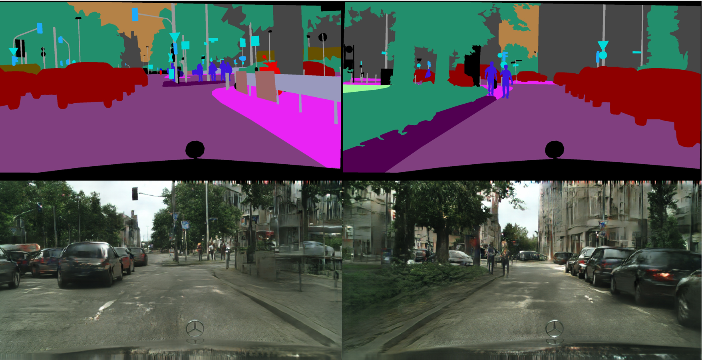

# Implementation of [pix2pixHD](https://arxiv.org/pdf/1711.11585.pdf) with [Oneflow](https://github.com/Oneflow-inc/oneflow) framework.

This work is based on two repo: [pix2pixHD](https://github.com/NVIDIA/pix2pixHD) and [CelebAMask-HQ](https://github.com/switchablenorms/CelebAMask-HQ).


## Results

### Cityscapes
First train the global net for 78 epoches and then jointly train the local enhancer and global net for 194 epoches:

<div align='center'>
  
</div>


### CelebA-HQ

Only train the global nets for 33 epoches:
<div align='center'>
  
</div>


### Demo of interactive facial image manipulation


## Environment
| Spec                        |                                                             |
|-----------------------------|-------------------------------------------------------------|
| GPU                         | Nvidia TITAN V                                              |
| CUDA Version                | 11.1                                                        |
| Driver Version              | 455.32.00                                                   |


## Requirements

- python3
- [Oneflow](https://github.com/Oneflow-Inc/oneflow#install-with-pip-package)
- `pip3 install -r requirements.txt`

## Testing
### Pretrain models

Download the `Cityscapes` and `CelebAMask-HQ` pretrain models:

```bash
wget https://oneflow-public.oss-cn-beijing.aliyuncs.com/model_zoo/cv/gan/pix2pixHD_pertrain_model_v2.tar.gz
tar zxf pix2pixHD_pertrain_model_v2.tar.gz
ls pix2pixHD_pertrain_model
# CelebA_pretrain  Cityscapes_pretrain
mv pix2pixHD_pertrain_model/CelebA_pretrain .
mv pix2pixHD_pertrain_model/Cityscapes_pretrain .
```

### Testing on Cityscapes

Set the downloaded pretrain model path and run script `scripts/test_local_cityscapes.sh`:

```
PRETRAIN_MODEL="./Cityscapes_pretrain/epoch_194_iter_600_Gloss_6.874650_Dloss_0.702645"
```

### Testing on CelebAMask-HQ

Set the downloaded pretrain model path and run script `scripts/test_global_CelebA.sh`:

```
PRETRAIN_MODEL="./CelebA_pretrain/epoch_33_iter_3900_Gloss_11.698519_Dloss_0.452646"
```

### Run the interactive facial image manipulation demo

Set the `PRETRAIN_MODEL` variable in script `scripts/run_face_mask_edit.sh` the same as `scripts/test_global_CelebA.sh` and then run:

```bash
scripts/run_face_mask_edit.sh
```

## Training

Download the VGG16 pretrained model:
```bash
wget https://oneflow-public.oss-cn-beijing.aliyuncs.com/model_zoo/vgg16_of_best_model_val_top1_721.zip
```
### Training on Cityscapes task

#### 1. Train the global net and local enhancer seperately

Train global net, remember to set the right VGG16 model path:
```bash
bash scripts/train_global_cityscapes.sh
```

Train local enhancer, uncomment the last line of script `scripts/train_local_cityscapes.sh`:

```bash
python3 train_of_pix2pixhd.py \
    --loadSize $LOAD_SIZE \
    --gpu_nums $GPU_NUMS \
    --batchSize $BATCH_SIZE \
    --netG $NETG \
    --ngf $NGF \
    --lr $LR \
    --network_module $MODULE \
    --dataroot $DATA_ROOT \
    --checkpoints_dir $CHECKPOINT_DIR \
    --train_tmp_result $TRAIN_TMP_RESULT \
    --load_pretrain $LOAD_PRETRAIN \
    --no_global_generator     ### if you want to train local network only, 
                              ### you can pass this parameter into the
                              ### `train_of_pix2pixhd_pipeline_parallel.py` script
```

to make sure only train the local enhancer.

```bash
CUDA_VISIBLE_DEVICES=0,1 bash scripts/train_local_cityscapes.sh
```

#### 2. jointly train the local enhancer and global net

Merge the local and global checkpoints together with script `scripts/merge_params.py`. And then set the `LOAD_PRETRAIN` to the merged checkpoint path. Also, remember to comment the last line of script `scripts/train_local_cityscapes.sh`:

```bash
python3 train_of_pix2pixhd.py \
    --loadSize $LOAD_SIZE \
    --gpu_nums $GPU_NUMS \
    --batchSize $BATCH_SIZE \
    --netG $NETG \
    --ngf $NGF \
    --lr $LR \
    --network_module $MODULE \
    --dataroot $DATA_ROOT \
    --checkpoints_dir $CHECKPOINT_DIR \
    --train_tmp_result $TRAIN_TMP_RESULT \
    --load_pretrain $LOAD_PRETRAIN \
    # --no_global_generator     ### if you want to train local network only, 
                              ### you can pass this parameter into the
                              ### `train_of_pix2pixhd_pipeline_parallel.py` script
```

Before running the script, make sure that each GPU has at least 10G memory:

```bash
CUDA_VISIBLE_DEVICES=0,1,2 bash scripts/train_local_cityscapes.sh
```

### Training on CelebAMask-HQ task

```bash
bash scripts/train_global_CelebA.sh
```

If you want to train on full `CelebAMask-HQ` dataset, you can refer to [CelebAMask-HQ](https://github.com/switchablenorms/CelebAMask-HQ).


